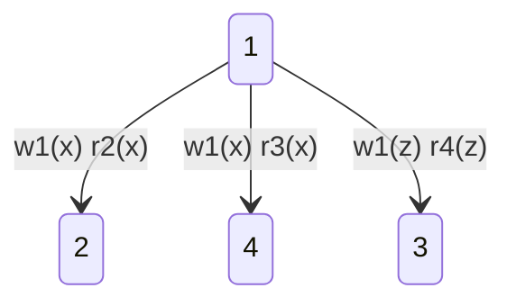

# **Data Warehousing**
There are several **layers** in an application:

---

								Presentation

---

								Application

---

								   Data

---
The idea is to have one clean and well organized database, but in the reality there are a lot of replicas of them with variation in the real life applications.
It is possible also to have incoherent database in the same application.
It is also possible to have different database, with different types of storage (like a csv file and a relational database and so far).
There are also some data that must be accessed outside of the application boundary because they are stored in an external database.

**Open data**: data reachable from everyone published by an organization.

**OLTP**: On Line Transaction Processed: for example registration of a student or a professor in the database, that passes truth the presentation, application and data level.
ex: INSERT, DELETE, UPDATE, SELECT.

**OLAP**: The goal of On Line Analitica Process is to analyze online data, not inserting or removing or get just one data, but the process of analyzing them. For example, Machine Learning is based on data analysis and therefore OLAP.

#definition 
> A **data warehouse** is a repository that integrates and reorganize data collected from different sites and makes them available for OLAP.

OLAP is used to make analysis, decision, predictions and ecc.
For this reason data are called the new oil, because they will be the fuel of the digital transaciton.

There are 1, 2 and 3 layer architectures to deal with data and requests, to build a data warehouse.

## ETL
ETL consists in four phases:
 - **extraction;**
 - **cleansing (or cleaning);**
 - **transformation;**
 - **loading;**

who knows the fuck does this means?
He said he will not go into detail of ETL. Sbrudulain.

What's **inside** DW ?

![[Pasted image 20250306121418.png]]

The multidimension is given for example when I want to know how many items have been sold by a certain store in a certain date. I have 3 dimension: store, item, date.
In the dimension that we define, we can define a hierarchy like days > weeks > months ecc ...
This hierarchy could be usefull when a lot of datas comes across our hands and we have to handles them.
We must remember that this cube is just a relation, and could be represented as a table.
We can turn also hierarchies in relations and in tables.

### Hierarchy
We can instanciate hierarchies between the data objects that we analyze.
Hierarchies are tree-structured, and represents the data in a hierarchical way.

#DeductionvsInduction
> Deductions happens from logical rules that I already know, 
#### Data mining
Data mining is based on looking the data and search for patterns into the data that you stored.

### OLAP session
A task that execute a particular navigation path while exploring the data
Olap is the most popular way to eploit information from a data warehouse.

#### Operators:

- **Rollup**: consent to navigate up the files
example: Roll up of time, if we are given months, will go up and give us a representation with quarters.

ex:
| Month | Money |
|--------------|--------------|
January |        10 |
February|        5  |
March   |         8  |
April     |          6 |
becames
Q1       |            29|

**Drill down**
Opposite,going back in a more detailed view of my data.
Obviously if we have our original view, we cannot do drill down since we already have the most detailed view possible for our data.

**• Slicing:** reduces the number of cube dimensions after
setting one of the dimension to a specific value
**• Dicing:** reduces the set of data being analyzed by a
selection criterion

**Pivoting**
Raws becomes columns.

Drill across
We can merge 2 queues of the same type of ìdata.
The data must be of the same type in order to be drilled across.

This operators are just an abstractions, every language implements the operators in a different way.

ROLAP 
Implementing multidimensional data model realtional.
MOLAP (not relational multidimensional data model).

First thing to remember when modeling data with ROLAP:
- Take the multidimensional cube and turn it into a table (remember the relational model);

So we can have a schema representation ( the tree ).
In the relational form, the tree is represented with a table.
for example:
h:
C -> B -> A
becomes:
h:

| A   | B   | C   |
| --- | --- | --- |
and we have the functional dependencies:
A -> B, A -> C, B -> C where the arrow stends for "functionally determines".
The we can state that A is a key.
For example if we have some data: (a1, a2, ecc...)

| A   | B   | C   |
| --- | --- | --- |
| a1  | b1  | c1  |
| a2  | b1  | c1  |
| a3  | b2  | c1  |
| a4  | b2  | c1  |
| a5  | b3  | c2  |
This is the resulting hierarchical table.
To represent the data in terms of their position in the multidimensional cube, we need to create a table and insert the dimensional coordinates as the entries in the table with a foreign key pointing to the hierarchical one.
We must also add a foreign key to fully represent the hierarchy.

Under the assumption that the table is static (cannot be  updated or modified), the data representetion obtained in the data warehousing technique that we have seen now.
Remember that a data warehouse is **NOT DYNAMIC**.
Facts are never deleted, but may be only added.
So in the contest of data warehousing, this kind of tables that join all the data togheter (also informations that in principle should be separated) are acceptable. They are called denormalized.

We need a design metodology to design a data warehouse.
### Design methodology

Data layer:
 - conceptual design;
 - er schema;
 - logical design;
 - relational schema;

**DATA WAREHOUSE:**
Here we have the idea of dimension, so we must implements another topology.
- Conceptual design phase;
- Dimensional fact modeling (DFM) and we obtain DFM schema;
- Logical design (ROLAP);
- Relational schema.

# DFM Schema

![[Pasted image 20250313120202.png|500]]

We have:
- **Fact:** 
- **Measures:**
- **Dimensions:**

Hierarchies are trees or graph structures associated with dimensions.
We can represent hierarchies in this way:

![[Pasted image 20250313120720.png|700|center]]

There can also exists descriptive attributes that are not usefull for the realization of the code, but is usefull for the understanding of the schema.

We can also have an attribute who's value depends on attributes of different dimensions.

DFM also has optional attributes. Also dimension can be optional, and in this case optional dimension cannot be part of the key.

Since attributes can be cross dimensional, we do not have a tree anymore, but a DAG.

Objects can also share hierarchies.

We can also have multiple arcs for example a book can have more then one author, so we will have more then one arch between 2 nodes.

Addivity
we can restrict the possisbility to aggragate with every function using a dotted line and explaining

# Star schema
We can also provide a schema in form of star, like this one:
![[Pasted image 20250317133103.png|600|center]]

We will have a:
- **Fact table:** contains tuples at the choosen level of aggregations;
- **Dimension tables:** are completely denormalized;

**Denormalization** multiply the space for the table and increases the space that you have to use for the tables, but you will have to do few joins.
To get the multidimensional view of the data can be given by denormalized datas by just joining every dimesinon.
EX:
Select *
from SALES s join STORE st on s.keys = st.keys
join PRODUCT p on p.keyp = skeyp
join DATE d on s.keyd = d.keyd

### Snowflake schema
![[Pasted image 20250317141039.png]]

In this case, datas are not completely denormalized.

### Logical design
Main steps in DW logical design are:
1. Choosing the logical schema to adopt (e.g., star/snowflake schema);
2. Translating fact schemata into logical schemata;
3. Materializing views;
4. Realizing some forms of optimization;

Exercise:
![[Pasted image 20250317143745.png]]

1) DFM schema:
Exercise on paper.

<<<<<<< HEAD

---

# NO SQL

Relational database schema are static, but data changes continuously and increase or decrease. For this reason, since relational database are not **flexible**, No SQL are concretely used in real life.

## Graph database
We can have database in form of graph.
This kind of graphs are used for example in social network database.

Litterally a graph, with nodes, edges, and properties to represent and store data.
Can be used for example to represent:
- Social networks;
- Maps with streets and places on the globe;
- ecc...

The advantage is for example to create 2 different kind of relation for the same object with 2 different entities and with different characteristics. With relational database, I should've used different tables, here I just need to create 2 different edges wich is completely natural in a graph approach.

Practical example:
![[Pasted image 20250324134608.png]]

Query needed to search for Alice friends in a relational database.
In a graph, I just need to follow a path, which is much easier.

### Implementations
We can implement a graph in Adjacency list.
Each node has a list of neighbors.

### Queries
How to query a graph db ?
We will have labelled edges, and we will use regex.
Regex example:
L = (a | (bc) +)?
L = {$\epsilon$,a,bc,bcbc,bcbcbc,...}
Why are we talking about regex?
Because nodes are labelled with letter in alphabtes, so **each path in a graph db is defined by a regex**.

## Neo4j
Graph database representation.

1. Node: (node);
2. Edge: -[edge]->
3. Labels: (x:Director) where:
	- x is the name;
	- Director is the label; 
4. Properties: properties of a node are expressed as: $\{p_1,p_2,...,p_n\}$;

After the nodes creation that happens as described before, if you want to modify the schema afterwards you will have to match every node with and identifier.
EX:
match (m ,{name: 'Lenzerini'}),(dm {name: 'Data Management'})
CREATE (m) -[Teaches]-> (dm)

Queries:
...

---
# RDF
New NoSQL database.
Resource Description Framework is considered a data model for the web.
Basically is a graph database.
Every entry in this database is a triple, subject, predicate, object.
Every edge in a graph database, at the end, is actually a triple.
We also have BLANK NODES as models of triples.

We have index, and this index must be updated at every operation, but queries are much faster.
RDF is just a particular type of relational database.
Naive approach:
Store all the triples in  table (vertical representation)

Horizontal
We can have an horizontal representation in which we group for example all the subject of the tuple (TRIPLES) and create a single entry in the table.
Pros:

Cons:
- There will be a lot of nulls;
- I might have different tuples with same subject and same object

Query lenguage for RDS:
**SPARQL**

---
## Knowledge graphs

A lot of request for machine learning engeneers.
Difference between data base and knowledge base.

#### Knowledge base
A database satisfies the costraints if all the conditions imposed in the foreign key constraints are respected.

A knowledge graph can deduce if something is missing in order to satisfy a constraint, and add it using also null values.

We define an RDFS (RDF schema) in the following terms:

#### Alphabet
A set of symbols. Some of theme are already defined in RDF.
We also have some class in RDF, for example:
rdf:Resource is a class of everything;
Class: is a class;
type: used to assert that a resource is an insatance of a class;
subClassOf: triv
Property: is a class whos istances are the properties of the class;
example of properties:
- domain is used to assert the class of the first component;
- range =================  of the second component;
- subPropertyOf;
 So we basically have classes and properites.

#### Syntax
X rdf:type Y
The same symbol could be used as a property and as an individual;

Schema informations and data informations are mixed.
For example:
	  /------------------      **PERSON**      --------------------\
	 /                                                                                           \
	/                                                                                              \
 **Student**      <--rdf:domain--  has supervisor    --rdf:range->  **Researcher** 
   ^                                                                                                      ^
   |                                                                                                       |
**Frank**                           ----   has supervisor   --->                     **Jean**

This cannot be represented as a database because Frank is a stuend but there is no person wich name is frank, even tho each student is a person.

Closed world assumption: everything that is not in the database is false.
A database follows the closed world assumption.
In Graph knowledge there is NO closed world assumption.
We can also answare I don't know in the knowledge graph, so this modifies the closed world assumptions. In this case, the answare NO should include negative informations in the database.

#### Semantics
Based on the notion of **interpretation**.
Interpretations are composed of:
- Domain of the interpretations;
- The interpretation itself;
Extension is an interpretation of a generic graph.
There could be multiple interpretations of the same graph.
In the interpretation of a predicate, we have to formally define it.
EX:
rdf:domain = cock
I is "good" if elem are coherent with the knowledge

---
3 Most famous no SQL database:

key value;
graph database;
document based;

### Key value
We can access values based on their keys.
It is like a dictionary.
Values can represent different attributes, and are blocks of informations. This values doesn't have to keep a fixed schema. Values are single objects and can be modeled in anyway.
We cannot access only a part of the value, we must take it all.
### Document-based
Whenever I talk about documents, I refer to aggregates.
A document is a structure of key-value pairs, where the values are as complex as you want.
Documents are usually represented trought the JSON format.
We can define transformations for JSON objects.

#### Differences:
With key value you can't access part of the value, with document based you can access single parts of the value since is a JSON file, accessing only a part of the whole value content.

# MongoDB
Document-based data base.
Open source, No SQL, DataBase Management System, relies on BSON (Binary JSON).
Same structure of JSON, with specific data types.

To create a collection we will have a validator, a list of required properties.
We can insert consrtraints on the data that are inserted in our schema.

dbcreatecollection{

}

---

	  /------------------      **PERSON**      --------------------\
	 /                                                                                           \
	/                                                                                              \
 **Student**      <--rdf:domain--  has supervisor    --rdf:range->  **Researcher** 
   ^                                                                                                      ^
   |                                                                                                       |
**Frank**                           ----   has supervisor   --->                     **Jean**

Can this graph be regarder as a database ?

We know what is a graph database, but now we ask: What is a Knowledge Graph ?
Remember that the closed world assumption is not valid in a graph knowledge base.
Delta I is the set of all URIs.
The interpretation is not necessarly coherent with the graph, but it must be coherent with the alphabet. That's not the same if we talk about **models**.
We call **Models** of the graph a good interpretation, an interpretation that respects all the triples of the graph.
Blank node in a graph database allows us to choose between different interpretations, unlike the Null value in the regular database.

---
# Buffer manager

### Secondary storage
A database is a set of database files, where each file is constituted by a set of pages.
Using a page requires to bring it in main memory.

The **database buffer** (also called simply buffer or buffer pool) is a
non-persistent main memory space used to cache database pages.

The **buffer manager** is responsible of the transfer of the pages from the secondary storage to the buffer pool, and back from the buffer pool to the secondary storage.
It's scope is to minimize secondary memory access.

![[Pasted image 20250424101628.png]]
This is the buffer architecture.

### Operations

The buffer manager uses the following **primitive operations**:
- Fix: load a page;
- Unfix: releases a page;
- Use: registers the use of a page in the buffer;
- Force: synchronous transfer to secondary storage;
- Flush: asynchronous transfer to secondary storage;

#### Fix
The fix operation **load** a specific secondary storage page into the buffer.
The buffer manager manages this operations using 2 counters:
- **pin-count(F)**: how many transactions are using the page contained in F (initially, set to 0).
- **dirty(F):** a bit whose value indicates whether the content of the frame F has been modified (true) or not (false) from the last load (initially, set to false).
So the buffer manager will have to load a page in a Frame.
If the page is already in a frame, he will just increase his pin-counter.
If the page is not in a frame, he will have to find a free frame, or replace a page in a frame with the new one by means of a  **replacing policy**:
- RU (least recently used): this is done through a queue  containing the frames F with pin-count(F)=0;
- Clock replacement;

#### Unfix:
Transaction T certifies that it does not need the content of a
specific frame anymore
The pin-counter of that frame is decremented

#### Use:
The transaction modifies the content of a frame
The dirty bit of that frame is set to true

#### Force: 
Synchronous (i.e., the transactions waits for the successful
completion of the operation) transfer to secondary storage of the
page contained in a frame

#### Flush: 
Asynchronous (i.e., executed when the buffer manager is
not busy) transfer to secondary storage of the pages used by a
transaction

But, what is a transaction ?
For example, in database we did:
begin transaction:
...
end transaction.
Transactions are operations defined in brackets that must be treated as **atomic operations**.

There are 4 basic properties that we want to achieve: **ACID**
1. **Atomicity**: for each transaction execution, either all or
none of its actions have their effect
2. **Consistency**: each transaction execution brings the
database to a correct state (as state where no integrity
constraint is violated)
3. **Isolation**: each transaction execution is independent of
any other concurrent transaction executions
4. **Durability**: if a transaction execution succeeds, then its
effects are registered permanently in the database

We have to be sure that even if a transaction satisfies the ACID properties, also the other concurrent executions behaves correctly.

We have to schedule transaction in a correct order.

A schedule S is serializable if there exists a serial schedule which is **equivalent** to S.
equivalent = $\forall input$ they produce the same output.

### Anomaly
There are different classes of anomaly:
- **Reading temporary data** (a write modify the value I want to read in the middle of my transaction);
- **Update loss** (Another transaction occurs between my read and write opeartion, modifying the element I wanted to write);
- **Unrepeatable read** (read twice same variable, but get 2 different results);
- **Ghost update** (Write on an element from a transaction occurs immediatly before it is modified by another transaction);

#### Scheduler

A schedule represents the sequence of actions of transactions presented to the data
manager. The **scheduler** is the part of the transaction manager that is responsible of
managing the schedule.

#### Class of schedules
We have different class of schedules:

All
schedules
							
Serializable
schedules
							
Serial
schedules

### Assumptions
2 important assumptions:
 - No transaction read or write the same element twice;
 - No transaction reads an element that it has written;
 - Transactions are just composed by read and write;

##### Reads-from
In a schedule S, we say that ri(x) READS-FROM wj(x) if wj(x) preceeds ri(x) in S, and there is no action of type wk(x) between wj(x) and ri(x).
##### Final-write
In a schedule S, we say that wi(x) is a FINAL-WRITE if wi(x) is the last write action on x in S. 

## view-equivalence
Let S1 and S2 be two (total) schedules on the same transactions. 
Then S1 is view-equivalent to S2 if S1 and S2 have the same READS-FROM relation, and the same FINAL-WRITE set.

## view-serializability
A (total) schedule S on {T1,…,Tn} is view-serializable if there exists a serial schedule S’ on {T1,…,Tn} that is view-equivalent to S.
Checking a schedule for view-serializability is NP Complete.
So in practice, it is not possible to use it.

## serializability
A schedule $S$ is serializable if exists a schedule $S' \neq S$ that, for every input, will provide the same output as $S$.

A schedule can be serializable but not view-serializable;

---
## **EXERCISES**
#exercises

• Consider the schedules:
1. w0(x) r2(x) r1(x) w2(x) w2(z)
2. w1(y) r2(x) w2(x) r1(x) w2(z)
3. w1(x) r2(x) w2(y) r1(y)
4. w0(x) r1(x) w1(x) w2(z) w1(z)
and tell which of them are view-serializable
• Consider the following schedules, verify that they are not view-
serializable, and tell which anomalies they suffer from
5. r1(x) w2(x) r1(x)
6. r1(x) r2(x) w1(x) w2(x)
7. w1(x) w2(y) w1(y) w2(x)

Exercise 1a
• Consider the schedules:
8. w0(x) r2(x) r1(x) w2(x) w2(z)
9. w1(y) r2(x) w2(x) r1(x) w2(z)
10. w1(x) r2(x) w2(y) r1(y)
11. w0(x) r1(x) w1(x) w2(z) w1(z)
and tell which of them are view-serializable

• Consider the following schedules, verify that they are not view-
serializable, and tell which anomalies they suffer from
12. r1(x) w2(x) r1(x) -- unrepeatable read
13. r1(x) r2(x) w1(x) w2(x) -- lost update
14. w1(x) w2(y) w1(y) w2(x) -- ghost update

Exercise 1b
Consider the following schedule
S = r1(x) w3(x) w3(z) w2(x) w2(y) r4(x) w4(z) w1(y)
and tell whether S is view-serializable or not, explaining the answer in detail.

READ FROM = {r4(x) reads from w2(x)};
FINAL WRITE = {w2(x),w1(y),w4(z)};

I take this set and compute a different sequence with the same set, respecting the anomalies rules.

$S' =$ r1(x) w3(x) w3(z) w2(x) r4(x) w2(y) w4(z) w1(y)

---

### Conflicts and commutations
We consider arbitrary actions.
There are actions that are confilcting.
Based on conf(S), we can define the **commutativity rule** for a sequence S as follows: if p,q are adiacent actions in S belonging to different transactions, and they are such that <p,q> is not in conf(S), then the sequence p,q can be replaced by the sequence q,p (in other words, p and q can be swapped).

## Swapping
We are here introducing the concept of swapping.
When can we swap actions in our context (read write operations only) ?
- Swapping 2 consecutive reads in different transactions;
- More generally, when swapping 2 actions will result in changing the result, then the actions are conflicting. Otherwise, they can be swapped.

#### Conflict-equivalence
A sequence is conflict equivalent to another if you can produce it by swapping non-conflicting actions between each other.

#### Conflict serializable
A sequence is conflict serializable if it is conflict equivalent with another sequence.

To better visualize this conflicting sequence, we can draw a precedence graph, and the build an alogotihm on the graph.
Every edge is a constraint on the set of the conflict-equivalent possible sequence.
So we need to search another graph with the same topological order.
If we find another graph with the same topological order, we have found a conflict-equivalent. But a graph can't have a topological order if it has cycles.
So we can say that if a graph has a cycle it is not conflict-serializable.

---
## **EXERCISE**
#exercises 

Exercise 4
Check whether the following schedule is conflict-serializable
w1(x) r2(x) w1(z) r2(z) r3(x) r4(z) w4(z) w2(x)

We have the following constraints 

No cycle, so there exists a conflict serializable schedule.

---
Trying to prove something:

$READFROM (S) \neq READFROM(S')$
Supposing we have a pair $(w_j(x), r_i(x))$ in the relation for S but not in the relation for S'.
Now, if S' has not the same sequence, what happens is:
- 
  

Ex:
w1(y),w2(y),w2(x),w1(x),w3(x)

It is view-serializable but not conflic-serializable.
We can group all the transaction with the same number togheter.
T1 = w1(y)w1(x)
T2 = w2(y)w2(x)
T3 = w3(x)

## Exercise
$S = r1(x) w2(x) w1(x) w3(x)$
1. Is $S$ view-serializable ? 
2. Is $S$ Conflict serializable ?

Answare:
1. Analyze:
	   - READ-FROM = {};
	   - FINAL WRITE = {w3(x)};
	Is view serializable!
2. Analyze:

### OCSR 
Let CSR denote the conflict-serializable schedules.
We will say that OCSR are order-preserving conflict serializable schedules, in which, if a transaction t precedes t' completely in S, then it does also in S'.
This schedule is conflict serializable but not OCSR:
S = w1(x) r2(x) c2 w3(y) c3 w1(y) c1

### COCSR
Commit order preserving conflict serializable. Simply means that is OCSR and the transactions close **and is committed** before the successive transactions are performed.

###### Implications order
![[Pasted image 20250701182620.png]]

## Transaction scheduler
![[Pasted image 20250505133417.png|550]]

That's it.
The transaction scheduler must adopt a protocol to order and correctly perform the stream of transactions that he receives.

#### SGT
Serialization graph testing. The method consists in crafting a priority graph for the transactions in a schedule and update the graph each time a new transaction is received. Then proceed to execute transactions following the graph order.
Mantaining the graph could be costly so is not used in practice.

---
Primitives for exclusive lock

We have 2 primitives:
- lock;
- unlock;

Each actions performed in critical section must lock element before using and unlock it after using.

How does a scheduler works?
Passive lock-scheduler:
- Lock table: wich transaction holds the lock for each variable;

<<<<<<< HEAD
###### Definition of two-phase locking protocol (with only exclusive locks): 
A locking scheduler (with exclusive lock) follows the two-phase locking protocol if for every
output S generated by the scheduler and every transaction Ti appearing in S, all
lock operations of Ti precede all unlock operations of Ti.

=======
### 2PL scheduler
Using commands like lock and unlock.
- With exclusive lock: A class of schedule such that:{ DT(S) | there exists a schedule S' such that S is the output of a 2PL scheduler with exclusive locks when processing S'};

#### Exclusive lock
The following two rules must be satisfied in order for a lock-extended schedule to
be **meaningful**:
- Rule 1: **well formed transactions**: a transaction is well-formed if it lock and unlock are not issued more then once, and if every operation is delimited by a pair of lock-unlock operations;
- Rule 2: **legal schedule**: a schedule is legal if no transaction in it locks an element when a different transaction has already locked it.
Locking scheduler can be **passive** or **active**.
##### Passive locking scheduler:
When processing a step oi(x) of the input lock-extended schedule S
(where oi ∈ {r,w}), the passive locking scheduler proceeds as follows:
if x is locked by Ti then oi (x) proceeds,else Ti is blocked (and re-executed later on).
The locking scheduler makes sure that, before dimissing Ti, the command ui(x) is present in the output for each item x such that li(x) is present in the output.
![[Pasted image 20250512133011.png]]

As show in the picture, even if a sequence is not legal is valid for the extended-lock passive scheduler wich will just let the transaction locking an already locked variable wait for it.
This could lead to **deadlock** if 2 transactions operating on 2 different variables tries to locks each other variables (wait indefinitely).

The **active** locking scheduler behavior is more complex, because it may decide atonomously to issue lock or unlock commands in order not to block the transactions.
Examples:
Input : l1(x) r1(x) w2(x) l2(y) w2(y) u2(y) c1 c2
Possible output : l1(x) r1(x) u1(x) l2(x) w2(x) l2(y) w2(y) u2(y) u2(x) c1 c2
Input : r1(x) w2(x) w2(y) c1 c2
Possible output : l1(x) r1(x) u1(x) l2(x) l2(y) w2(x) u2(x) w2(y) u2(y) c1 c2

Now we define **DT(S)** as the data action projection of s (we consider only  read, write, commit and abort of a schedule).
Example:
Schedule S = l1(x) r1(x) w2(x) l2(y) w2(y) u2(y) c1 c2
DT(S) = r1(x) w2(x) w2(y) c1 c2

---
**Multiversial transactions**

Never stop a read operation.
We insert different version of write function.

---
### Transactions in SQL

We have 3 anomalies in SQL:
- Dirty read:
- Non repeatable read: when a transaction read same element twice;
- Phantom read: this happens when we operate on a range of tuples, and in the same time another transaction operates on that tuples. Then our range operation will be disturbed. We need to range lock the elements;

In postgreSQL the minimum level of isolation is Read Committed (no dirty read is possible).

---

# **Access file manager**

We organize items on pages and records. 
Records contains data, wich could have variable length, and for this reason the allocation of pages could be dynamic.
Pages can be organized trought different data structures.
##### Heap
With heap, we have basically a linked list.
Cost to insert is constant, and cost to search and remove is linear.

##### Hashed file
Pages are organized into groups, where each group is a bucket.
Example:

>Search for professor "Mecella";

- "Mecella" will be the key of our research;
- We search for the bucket indexed with $h'(Mecella)$;

To evaluate the cost of the execution we will use the big O notation on parameter B, where B = number of pages accessed.
Operations could be:
- Scanning;
- Search for equality;
- Search in range;
- Insert;
- Delete;

Heap cost analysis:
- Scan: $O(B)$;
- Search for equality: $O(B)$;
- Search in range: $O(B)$;
- Insert: $O(1)$;
- Delete: $O(B)$;

In a sorted heap, we could use a more efficient way to search:
- Binary search: O(logB)
- interpolation search: $$i = a_1 +{ (K – K_{min}) \over (K_{max} – K_{min})} × (a_B – a_1);$$
Cost of interpolation: $O(loglogB)$;
In the hashed file model we have to keep the page up to the 80% of occuped space, because otherwise it will not work very well in terms of performance, indeed with 80% we can manage very well the pages with this ratio.

To sort 2 different and already sorted pages, we use a merge mechanism.
We sort 2 sorted pages by putting each element into a third one used to merge the sorted pages.
We obtain a new sorted list of pages.
#### 2 way sort
- Pass 0: input unsorted page: output sorted page;
- Pass 1: input 2 sorted pages: output 1 sorted page containing both:
- ...
- Pass K: input 2 sorted page: output 1 sorted page and no pages left.
When the buffer is full, we write in secondary storage.

Why is 2 way alogrithm ? Because we are using 2 buffer frames plus 1!
I always merge 2 files.
Each fragment, at the beginning, contains 1 page.

If I use F frames in the buffer, I will merge F-1 page at each step.
So in this case we will have that pass 0 performs B operations, pass 1 performs B/F operations, pass 2 B/{F*(F-1)} ecc...

### The notion of index
> An index is siomething associated with a relation.

Any **index** organization is based on the value of one or more predetermined fields of the records of the relation we are interested in, which form the so-called **search key**.

An index has some properties:
- **Organization**:
	We can organize index as:
	- Sorted index;
	- Tree-base index;
	- Hash-based index;

- **Data entries**:
	K* is the value of the data entry wich index is K.
	We have different way to store entries:
	data record, pair storing (k,r) where r is a reference to data record, and pair storing (k,r-list) where r-list is a list of references (usefull when there are many records with the same key)

- **Clustering**:
	An index is clustering if data entries stored order are coherent with the order of data record.
	If an index is clustered then it could be used for internal range search.

- **Primary** or **secondary**:
	Primary: the search key is the key of the relation.
	The primary index cannot contain duplicates, otherwise it is called secondary index.
	A secondary index is called unique if its search key contains a non-primary key (in this case it does not contain duplicates obviously).

- **Dense** or **sparse**:
	Dense: if every value of the search key that appears in the data file appears also in at least one data entry of the index. Basically the index must contain all the elements.
	Sparse is not dense.

- **Single** vs **composite key**:
	A search key is called **simple** if it is constituted by a single field, otherwise is called composite.

## Sorted index organization
Example:
We have a relation constituted by 10'000 pages.
Relation R is constituted by 10 attributes.
Each pages contains 20 data records (So in every pages I can store 200 values).
So if we choose to represent indexes as <SearchValue, PointerToData>, we will have 2 values for each data, this means I can store 100 data record in a page.

> A **sorted index** is a sorted file of data entries.

#### Clustering

The most popular and implemented was the clustering sorted index (keep the relation sorted on primary key and build the cluster on the search key being equals to the primary key). 

> When we have a **SPARSE** index we usually have 1 data entry for each page!
> With the **DENSE** one, we have one data entry for each value.

![[Pasted image 20250521113942.png]]
EX: Search for data entry having 70 < Index < 175:
We search for the value (70), we go in the sequential file and scan all until the range is no more valid.

> **Strongly dense**: As many data entries as the data values;

If we have secondary non unique sorted index how can we do?
We will have dense index.
If there are more than 1 value for the same key, we can use non strongly dense and just aggregate the pointers for the same search values.![[Pasted image 20250521114636.png]]

What about an insertion algorithm ? Think about it.

#### Non clustering

- Non-clustering, primary (or unique) sorted index:
- Non-clustering, secondary non-unique sorted index

A sparse index does not make any sense.
Suppose we have an unclustered secondary index.
One possible implementation is the one with backets.
In the bucket implementation for each index we point to a bucket, wich is a list of indexes.
Then depending on the query, you can perform different operations on the query.

### Clustered file organization:
I use 1 file for more then 1 realtion (2,3,...). We used to have 1 file for 1 realtion only in the regular version (previous one).
This property could be helpfull if for example we are querying.

Sorted index is nice but:
- It has only **one level**;
- **Insertion** and **deletion** are a nightmare;

## Tree based index
Are trees, where every index is a tree of pages. Data entries (search value and pointer) are leaves of the tree. Data file is not part of the index.
The tree is structured as follows:
- Each node correspond to a page;
- We have a key and a pointer: each pointer Pi points at a right subtree with key value higher then the actual value and at a left tree with key value lower then the actual key value;
- The links between the nodes correspond to the link between pages;

We have 2 different kind of trees structure:
- ISAM: when the relation is static (no insertion nor deletion);
- B+-tree: Dynamic situation;

#### ISAM
Index Sequential Access Method.
Every intermidiate node has the same number of children. This makes the tree balanced so every path from root to leaf has the same length.
The cost to search into this tree will be $log_f(N$) where $f$ is the number of children.

#### B+- trees
We define the **rank** of the tree the number of search key values that can be fin in a page.
The B+- trees are still balanced, but the number of children for every node may not be the same: every node contain a number of data entries $m_i\ s.t.$ $${(d+1)\over 2}\le m_i \le d$$
where $d$ is the rank of the tree.
We need to keep the occupancy rate at 66% in order to have an efficient tree structure.

---
## Query evaluation algorithm

Algorithm to evaluate queries in an efficient way.

## One-pass algorithm
Needs only 2 frames, evaluates the query on one frame per time and when the other frame used to store the results is full the result are written on the buffer.

Examining particular queries:
- **Duplicate elimination**: our buffer needs to be at minimum as long as the frame we want to operate on;
- **Grouping** (not sorted)
	Suppose we have:
	
	Select A,B, avarage(C)
	from R
	group by A,B
	
	Having the relation R:
	R(A,B,C)
	Size of our frame M must be equal to the size of the relation;
- **Bag union**: Always in One Pass because I can parse frame by frame 
- **Set union**: Given 2 relation S and R, can do it in one pass if min ( B(S), B(R)) <= M-2
  This means if the number of frames in the first or second set (minimum number of frames) is smaller of equal then the number of frames in our M comparison set (-2 because we need to keep 2 frames, 1 for storing input frames and 1 for storing output frames);
- **Join**: Same as before, I can do it in one pass when the smaller fits in M-2 frames;

#exercises 
Exercise 2 Slides 32

### Nested loop techinques
Is used when I cannot do something with one-pass.
- **Set-union**(not sorted): The alogirthm is just loading page by page each set and compare each instance in a dumb and costly (quadratic) way. We have 2 sets S and R, we have M + 2 frames in our buffers. In this case the cost is $B(S) + B(S)\times B(R)$. If I have M frames, we have the cost  $B(S) + {B(S)\times B(R)\over M}$. One pass can be seen as a special case of Nested loop where M = B(S) or B(R basically.
- **Duplicate elimination**: I store M pages of my relation, and when I find a collision (2 equal frames), I delete the frame from the M pages stored in my buffer. The cost is:$B\times ({3\over 2}+ {B\over 2M}) + M$;
- All the other operations like join, ecc... are just like Set union.
- We cannot do group by in block nested loop! Because when you processs a set of blocks the point of nested loop is that you can forget about it after you processed it, but you cannot forget about blocks in some operations like bag intersection and group by;

---
## Two-pass algorithm

We have 1 pass algorithms for some operation.
Suppose I cannot do grouping in one pass, and neither in block nested loops.
I can do it in 2 passes.
2 kinds of two-passes alg:
- based on sorting;
- based on hashing;
We have our buffer with M frames. We have our relation R. Our R does not fit in M-2 (no one-pass allowded).
We can create M-1 sorted sublists.How ?
I load the first M pages on the buffer, I sort them and I write the sublist in  .
Let's assume that after a scanning I will have N-1 sublists $s_1, s_2, ... , s_n-1$.
Now I run a sort of merging algorithm by writing in our output frame.
Condition to group by: $B \le M\times (M-1)$.

Block nested loop is the only technique that works for computing cartesian product.
- Bag difference using 2-pass sorting algorithm costs 3*(B(R) + B(S))

New algorithm to compute join with 2 pass algorithm:
##### Simple sort join
We sort R, we produce a sublist and we merge it.
1) We sort R;
2) We produce the 2 sublists;
3) We merge the sublists;
The cost here is $5\times(B(S)+ B(R))$
Cost of sorting: $2B\times \#passes$

##### General costs
General costs for 2pass algorithm:
![[Pasted image 20250526135215.png]]

### Hashing based Two-pass algorithm
Use hash functions to generate indexes.
I read every page in the input, and I have 1 frame for each sublist ( = bucket ).
I apply hash function to each tuple, and it returns the right bucket in which to put the tuple.
When the bucket is full, I write it in a bucket in the secondary memory.

### Multipass algorithm
If we cannot do it in 2 pass we can do it (maybe) in multipass.

### EserciziSortedIndexConSoluzioni
Exercise one:
600'000 pages and 150 free frames.
1) Multipass merge-sort method: We have to sort R. We have M = 150 which is our buffer. First of all we have to produce the sublist. I will have 600'000/150 = 4'000 sublists. This will be 4'000 runs. Now I cannot do the merging phase because I have too much runs to merge.
   I merge the first 149 runs, which will result in 150\*149 pages = 22,350
   Now I will have 4'000/149 = 27 merge runs and one last step.
   Cost = 2 * number of passes * file size.

---
### Exercise on concurrency control

We will have to proof or disproof this kind of theorem:$$\forall x. \alpha (x) \implies \beta(x);$$
We have to look for a counterexample to prove that the statement is false, or we can reverse the formula otherwise if we think that the statement is true.

### Exercise 1

1. True:
   The reduced precedence graph is a subset of the precedence graph;   
2. False:
   I can do a counterexample: $R_1(x)R_2(x)W_3(x)W_3(y)W_1(y)$;
3. False:
   If has cycle in reduced graph is not conflict, but we cannot infer that it is not view a priori. We only know $Conflict \implies View$.

### Exercise 2
In our one-write version:
1. $Conflict \iff View$:
   - $Conflict \implies View$ well known for every sequence;
   - $View \implies Conflict$: Let's take a view equivalent sequence. We must have the same read from set and the same last write set of transactions. Is thise view equivalent set also conflict serializable? 
2. $2PL \implies Conflict$ 

 ---
 
 #### RELATIONS

### Exercise 6

R(A,B,C,D) relation whith 15'000'000
15 tuple in 1 page
R contains 31250 different values of attributes C.
There is a  clustering secondary non unique sparse sorted index using alternative 2 for R, C the a search key.
Which is the number of pages required to answare to the following query ?

select B,C,D
from R
where C = 70

Using index.

We can put 30 indexes and we need 1 million page.
We have 33'334 pages to store indexes.
To find an element since are ordered I perform binary search so cost is log2(33'334) = 16;
On avarage the number of record with the same number of C record is 15 million divided by 31250. = n.
n/15 is the expected number of pages that in which I will find an element with a conflicting C index as my index, and to that number I will sum the cost I computed to search the page with binary search.

### Exercize 7

R(A,B,..,L) with 6'000'000 and 100 entries for each page

1. We have a linear scan on the number of the page: $6'000'000/100 = 60'000$;
2. The cost of page access is linear on the number of tuples that satisfies the costraint plus a binary search on the whole file which costs log2(60000);
3. We have dense index, so we have 9 attributes times 100 space for each page which is 900, to store 3 slots for each index we have 300 space. We need 20'000 pages. Search cost is still binary search, log2(20'000) = ...;
4. 20'000/300 page on second level. access is no

---
### Index-based algorithms

Index-based algorithms use indexes. We introduce notion of **conformance** of an index to a condition: 

> An index **conforms** to a condition C when it can be used effectively to evaluate C.

**Prefix of a search key**: initial non-empty segment of attributes for a composite search key.

### Conformance of conunction
An Index is said to conform to the conjunction of atomic conditions` (att, op, value) and (att, op, value) , and ..` if:
- In the tree-based index, there exist a prefix P of the seach key such that, for each att in P, there exist a term in the form (att, op, value) in the conjunction
- In the hash-based index, for each attribute of the search key there exist an equality term in the conjunction

As an example:

A tree index with search key <r,b,s> conforms to the condition (r > ‘J’ and b = 7 and s = 5), and to (r = ‘H’ and s = 9) <since we have 'r' as the prefix, and it is present as a condition>, not to (b = 8 and s = 10) \<no prefix>

### Parallel algorithms
Not sharing anything, they can just comunicate with other systems by sending messages to each others.
So basically we have a distributed database system.

We will have horizontal data partitioning:
- Round Robin;
- Range based partitioning on one attribute of R, we choose an attribute and we decide that in a Node we store all the tuples who's value of that attribute is the choosen one;

Projection cost:
	B(R)/P where P is the number of parallelized data base.
	
The cost of duplicate elimination for parallelized algorithm is still B(R)/P;
In the case of natural join we will need to do a multipass algorithm to achieve the goal.

---

### Exercise 1

R stored in 8000 pages, S in 24000 pages and we have 200 free frames.
We want the bag difference.
1. Among 1 pass and 2 pass what do we choose?
2. Describe algorithm choosen compute size and number of sublist produced and tell how many page access.
###### Answares
1) For the bag difference in one pass we need the number of frames to be $\ge$ than the smallest number of pages between $R$ and $S$, but in this case we does not have this property satisfied so we will need to use a nested loop. We will instead use 2 pass algorithm. Since we have M = 200, and $M*(M-1) = 39'800 \ge B(R) + B(S) = 32000$, we can use 2 pass algorithm.

2) Size of sublist: $M = 200$, number of sublist $n = 8000 + 24000/200 = 160$, page access are $3\times (B(R)+B(S)) = 96'000$.

2nd scenario:
1) Also if S is sorted, the answare does not change at all from the previous one;

2) I would store S and R again and compute binary search to find an element, so for every element we will have $3\times B(R)+B(S) = 48'000$.

### Exercise 8

Travel relation with 4 attributes sorted on attribute cost. The relatoin has 3'000'000 tuples, stored in 300'000 pages, and 10'000 different values.

Query:
select code,nation
from TRAVEL
where cost > 1500 and cost <= 1500

Number of page access?
20 data entries for each pages of our indexes. But we will only have 13 datas for sure, so I will need 300'000/23'077.
The funout is the avarage between half and full nodes, so if the full page is 20 and half is 10, we will have 15 as funout.
