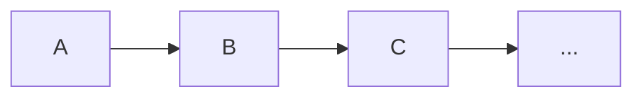
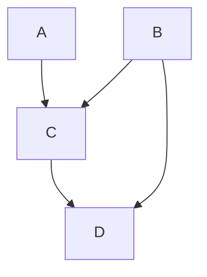
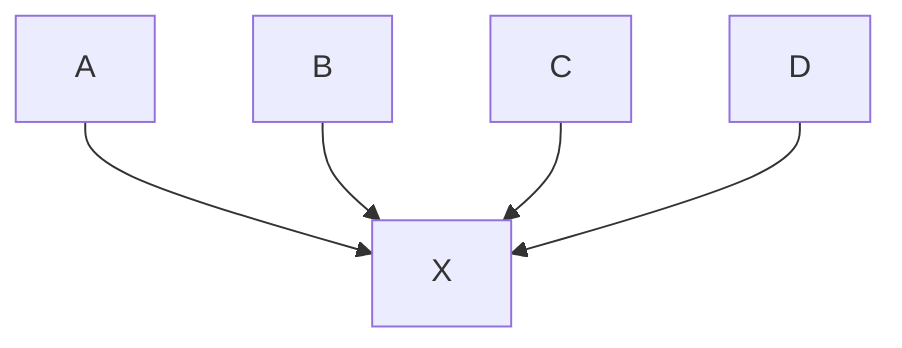

# Basic interaction patterns

A softwarre is made of several **components**, that can interact in a **synchronous** or in an **asynchronous** way, and can be sharing CPUs or other component, as well as stay completely separated (if we have processes running on different CPUs, then the system is distributed).

There are several basic interaction patterns between components.
The **main patterns** are:

- **REQUEST/RESPONSE**
	The most common patter. It is based on **synchronous** comunication.
	Basically, the caller commits a request, and **wait** for a response.
	Example: Function calling another function, REST API, Frontend service quering backend, ecc.
- **ONE-WAY MESSAGE** (FIRE AND FORGET)
	Components sends **asynchronous** messages to a queue or any without waiting for answare;
	Example: android app sends logs, sensor reading, ecc.
- **PUBLISH/SUBSCRIBE**
	**Publisher** sends event to an intermediary (**broker**) on a specific **topic**.
	**Subscribers** receive notification to the topics they are subscripted to.
- **EVENT NOTIFICATION**
	Passive components that reacts only to **events**. We have an event manager that handles event.
	Foundation of event-driven programming.
	All android softwares are event driver.

## Activity
An activity is an Android software components that reacts to events. Each activity responds to a set of predefined events by implementing callback methods.
Events are comunicated by special messages called **intents**.
Components like activities usually have states, and states usually changes during the lifetime of the software.
Intent are not confined in single application, but are system-wide. They can link applications between each other, and can be processed by any component.
**Intent flow** example:
![[Pasted image 20251009104614.png]]

Activities software runs on **main thread**, the UI basically. Touch events are sampled by a method called onDraw, which recurs every 16.7 ms, giving a refresh rate of 60 FPS.

# Computational graph
Basic interaction patterns can be modeled via computational graph.
In this graph, the nodes represents the components, the edges represents the interactions, and the graph can be linear, hub or DAG.

**Linear**

Example:
User insert data into application $\rightarrow$ data are processed in the backend $\rightarrow$ backend store data in database.

**DAG**

**HUB**

#definition 
> **Cloud-native applications**: applications where the computational graph run enterally on cloud and are made of small loosely coupled components that can easily scale.

> **Cloud Backend services**: components that run on cloud as support to applications running elsewhere (ex: mobile Backend as a Service (mBaaS)).

> **Lift & shift**: An application that usually runs on-premises and it is moved almost unchanged to run on a cloud.

---
# Cloud Computing

#definition 
**The NIST Definition of Cloud Computing**
> Cloud computing is a model for enabling ubiquitous, convenient, on-demand network access to a shared pool of configurable computing resources (e.g., networks, servers, storage, applications, and services) that can be rapidly provisioned and released with minimal management effort or service provider interaction. This cloud model is composed of five essential characteristics, three service models, and four deployment models.

**Deployment model**:
- **Public cloud**: cloud provisioned for open use by general public;
- **Private cloud**: provisioned for exclusive use by a single organization;
- **Hybrid cloud**: The cloud infrastructure is a composition of two or more distinct cloud infrastructures;
- **Comunity cloud**: Compostition of public and private cloud;

**Service model**:
- **Infrastructure as a Service** (IaaS): Allows to provision hardware and scale them very quickly; 
- **Platform as a Service** (PaaS): Offer way to develope sw without warning about management issue (ex: software to create websites);
- **Software as a Service** (SaaS): Full software that provides a service for the user, for example email service; 

**Service features**:
- **Resource pooling**: Computing resource pooled to serve multiple users;
- **On-demand self-service:** User can provision computing capability automatically;
- **Broad network access:*** Capabilities available and accessed over the network;
- **Rapid elasticity:** Capability scale with demand;
- **Measured service:** Automatically controlled and optimized resource with metering;

In simple terms, cloud computing refers to the shift of computing from a single server or data center to an equivalent service accessed via the Internet.

Another important concept in cloud computing is **multi-tenancy**.

#definition 
> **Multi-tenancy** means that multiple independent users (tenants), who are not related to each other, share the same application or infrastructure, while keeping their data and configurations logically isolated.

EC2 **Autoscaling** is a service that automatically scales the capacity of EC2 up or down
according to user-defined monitored conditions
For example, the number of replicas can be increased during a spike in the application
workload to meet the performance requirements and scaled down when the workload
decreases

This behaviour is costly and might register a slow down in performance since the software as to scale up or down dynamically, so it requires a tunneling activity which is not trivial.

### IaaS
IaaS are evolution of classical data center. It includes:
- **Cooling systems**: air conditioning and centralized cooling to maintain optimal temperature;
- **Power supply**: stable electrical power with backup systems;
- **Fire protection**: sprinklers or gas-based systems to prevent equipment damage;
- **Security**: personnel, access control, surveillance, and other protective measures;

Data centers turns energy into computation.
Servers are designed for 24/7 operation, and have 2 CPUs per board. They usually have large RAM size (>1TB), they have network cards with large bandwidth, and high storage capabilities.

(pg.10 pacchetto di slides n.4)