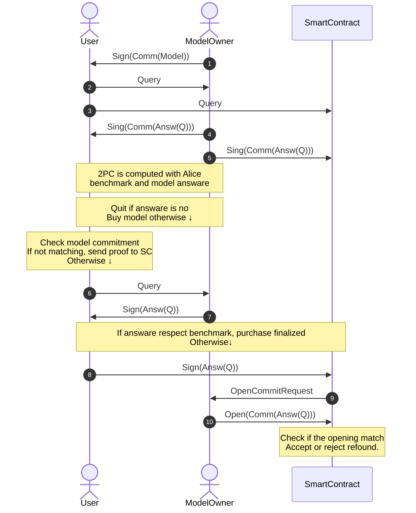

 Evaluation of Private Benchmarks on Privacy-Preserving Machine Learning Models
# Introduction and Motivation
Machine learning models today are very important assets. They are often the result of long and expensive training processes on large and private datasets. The final models, with their trained weights, represent valuable intellectual property, so owners usually want to keep them private and only give access to paying users.
At the same time, users who want to buy access to a model need to be sure that the model has good quality and is suitable for their tasks. Normally, before paying, users would like to test the model by asking some queries and checking the answers. However, this simple idea creates a serious problem. If the user can ask many queries for free during the test phase, they might get all the information they need from the model and then walk away without ever paying. This would mean a loss for the model owner.
Because of this, there is a clear conflict. On one side, the model owner wants to keep the model secret and safe from exploitation. On the other side, the user wants to keep their own benchmark private, since it often contains specific test data or policies that they do not want to reveal. The challenge is how to let the user test the model in a fair way, while protecting both the model and the benchmark.
This problem is becoming more and more relevant with the idea of “marketplaces for machine learning models,” where different models can be offered to users, who can then decide which one to buy. For such a marketplace to be trustworthy, we need clear
mechanisms for testing models privately and securely.

# Research Directions
This thesis will look at two main directions. Both approaches will require the use of secure multiparty computation (MPC), since MPC is the tool that allows the user and the model owner to jointly check if the answers satisfy the benchmark without revealing their private information to each other.

# Optimistic Solution
Our protocol works for deterministic models or, in the case of a Large Language Model
(LLM) this must be instructed to answer deterministically (yes or no). An initial optimistic
solution proceeds as follows:
1. The client submits to the model owner a query for which they already know the
answer. The query is also submitted to a smart contract.
2.​ The model owner computes the answer, computes a commitment to the answer,
signs the commitment, and sends the signed commitment to the client and to the
smart contract. To reduce overhead when answering many queries, instead of storing
randomness for all commitments, the model owner computes the randomness using
a PRF that takes sha256(query) as input.
3.​ A two party computation (2PC) is performed to evaluate private benchmarks (=
known answers or threshold-based scoring + weight of each correct answer) using
the model-generated committed responses. The 2PC outputs 1 if the responses
satisfy the benchmark. These private benchmarks ensure that the model owner
answers non-adaptively correctly assessing the quality of the model.
4.​ If satisfied, the client may purchase the model. From this point on, she keeps
receiving signed answers in clear from the model owner.
5.​ Note that, up to this point, there is no guarantee that the model owner actually used
responses generated by the model. However, if the client notices that an answer
does not match those from the trial phase, she can publish the newly signed
response to the smart contract.
6.​ If the model owner can show that the signed commitment (stored on the smart
contract) opens correctly, then she is exonerated; otherwise, they are financially
penalized.

This mechanism does not use SNARKs (which are heavy to compute) but instead relies on
smart contracts, thus incurring the economic costs of SC adoption.
### Protocol Overview

SNARK-based Solution
There are works such as Kang et al. (https://dl.acm.org/doi/10.1145/3627703.3650088) that
provides a SNARK proving that the answer to a public query is indeed computed by a
committed model or by a model with a public architecture.
The statement of this SNARK can be modified to also prove that the response derived from
the model is committed within the signed value.
With this tool, the protocol can be modified as follows:​
1.​ The model owner publishes a commitment of the model
2.​ The client submits to the model owner a query for which they already know the
answer.
3.​ The model owner computes the answer, computes a commitment to the answer,
computes a SNARK proving that the answer is generated from the committed model
and committed to a shared value, and sends the commitment and the SNARK to the
client.
4.​ A 2PC is performed to evaluate private benchmarks (= known answers or
threshold-based scoring + weight of each correct answer) using the model-generated
committed responses. The 2PC outputs 1 if the responses satisfy the benchmark.
These private benchmarks ensure that the model owner answers non-adaptively
correctly assessing the quality of the model.
5.​ If satisfied, the client may purchase the model.
This solution is more computationally expensive, since zk-SNARKs require heavy
computation to generate and verify.
Technologies
The technologies for this project may include:
●​●​●​●​SNARK development tools such as, still not defined which one:
○​ Circom: A language for designing zk-SNARK compatible circuits.
○​ SnarkJS: A JavaScript library for zk-SNARK proof generation and
verification.
○​ https://github.com/privacy-ethereum/halo2
Solidity and Ethereum Testnets: Solidity for smart contract implementation,
leveraging Ethereum-compatible test networks to conduct cost-free experiments and
validations.
	https://github.com/uiuc-kang-lab/zkml repository of the paper of Kang et al. easy to
use to compute SNARKs for machine learning model
MPC development framework, still not defined which one:
○​ MP-SPDZ: https://mp-spdz.readthedocs.io/en/latest/index.html
○​ https://mpc.pse.dev/ from ethereum foundation
Work Plan
The majority of the student’s work will be in developing prototype systems that realize these
protocols. This will require:
●​●​Implementing the optimistic solution, including the software components for the
model owner, the client, and the smart contract that enforces accountability through
blockchain in case of misbehavior.
Designing and implementing the MPC circuits that are necessary for benchmark
evaluation. These circuits will need to (a) realize the benchmark policy (e.g., count
how many answers given as input by the model owner match the expected answer of
the client) and (b) computes the SHA256 on the input of the model owner
concatenated with some random value;
●​●​Analyzing and modifying existing zk-SNARK frameworks (for instance, those
developed by Kang et al. (https://github.com/uiuc-kang-lab/zkml)) so that they can be
used to generate SHA-based commitment in the zk-SNARK circuit.
Benchmarking both approaches to assess their practical costs. For the optimistic
protocol, this may involve measuring blockchain transaction fees and latency. For the
zk-SNARK protocol, it will involve quantifying the computational cost of proof
generation and verification.
Expected Contributions
The main contribution of the thesis will be a prototype that shows how private benchmarks
can be evaluated on private machine learning models in a fair and secure way. The student
is expected to implement the optimistic solution fully, including the blockchain enforcement,
and to explore the zk-SNARK–based solution as much as possible. The thesis will also
present a comparison between the two approaches, showing their advantages,
disadvantages, and practical limitations.
Impact
If successful, this research will show how it is possible to create trustworthy marketplaces for
machine learning models. In these marketplaces, users can test and buy models while
keeping their benchmarks private, and owners can sell access without the risk of losing their
intellectual property. More generally, the thesis will give useful insights into how MPC,
blockchain, and zk-SNARKs can be combined to make machine learning services more fair,
private, and secure.