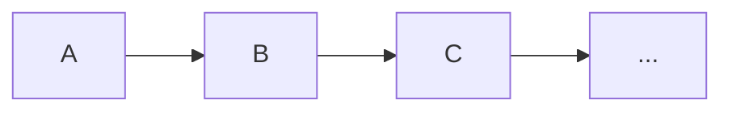
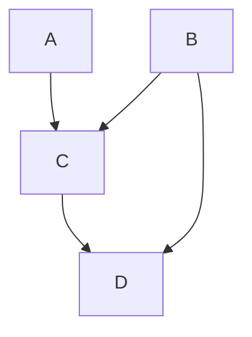
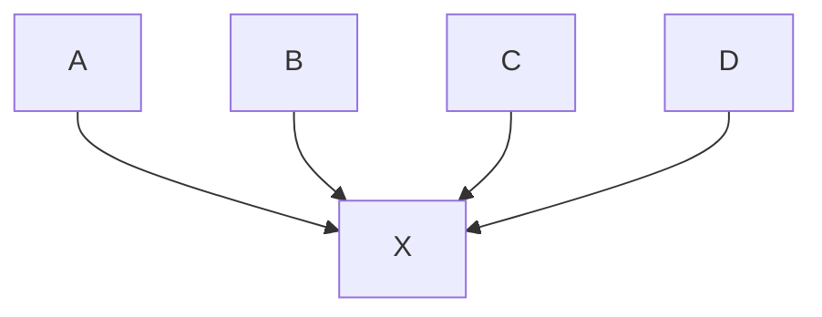

# Basic interaction patterns

A software is made of several **components**, that can interact in a **synchronous** or in an **asynchronous** way, and can be sharing CPUs or other component, as well as stay completely separated (if we have processes running on different CPUs, then the system is distributed).

There are several basic interaction patterns between components.
The **main patterns** are:

- **REQUEST/RESPONSE**
	The most common patter. It is based on **synchronous** comunication.
	Basically, the caller commits a request, and **wait** for a response.
	Example: Function calling another function, REST API, Frontend service quering backend, ecc.
- **ONE-WAY MESSAGE** (FIRE AND FORGET)
	Components sends **asynchronous** messages to a queue or any without waiting for answare;
	Example: android app sends logs, sensor reading, ecc.
- **PUBLISH/SUBSCRIBE**
	**Publisher** sends event to an intermediary (**broker**) on a specific **topic**.
	**Subscribers** receive notification to the topics they are subscripted to.
- **EVENT NOTIFICATION**
	Passive components that reacts only to **events**. We have an event manager that handles event.
	Foundation of event-driven programming.
	All android softwares are event driver.

## Activity
An activity is an Android software components that reacts to events. Each activity responds to a set of predefined events by implementing callback methods.
Events are comunicated by special messages called **intents**.
Components like activities usually have states, and states usually changes during the lifetime of the software.
Intent are not confined in single application, but are system-wide. They can link applications between each other, and can be processed by any component.

**Intent flow** example:
![[Pasted image 20251009104614.png]]

Activities software runs on **main thread**, the UI basically. Touch events are sampled by a method called onDraw, which recurs every 16.7 ms, giving a refresh rate of 60 FPS.

# Computational graph
Basic interaction patterns can be modeled via computational graph.
In this graph, the nodes represents the components, the edges represents the interactions, and the graph can be linear, hub or DAG.

**Linear**

Example:
User insert data into application $\rightarrow$ data are processed in the backend $\rightarrow$ backend store data in database.

**DAG**

**HUB**

#definition 
> **Cloud-native applications**: applications where the computational graph run enterally on cloud and are made of small loosely coupled components that can easily scale.

> **Cloud Backend services**: components that run on cloud as support to applications running elsewhere (ex: mobile Backend as a Service (mBaaS)).

> **Lift & shift**: An application that usually runs on-premises and it is moved almost unchanged to run on a cloud.

---
# Cloud Computing

#definition 
**The NIST Definition of Cloud Computing**
> Cloud computing is a model for enabling ubiquitous, convenient, on-demand network access to a shared pool of configurable computing resources (e.g., networks, servers, storage, applications, and services) that can be rapidly provisioned and released with minimal management effort or service provider interaction. This cloud model is composed of five essential characteristics, three service models, and four deployment models.

**Deployment model**:
- **Public cloud**: cloud provisioned for open use by general public;
- **Private cloud**: provisioned for exclusive use by a single organization;
- **Hybrid cloud**: The cloud infrastructure is a composition of two or more distinct cloud infrastructures;
- **Comunity cloud**: Compostition of public and private cloud;

**Service model**:
- **Infrastructure as a Service** (IaaS): Allows to provision hardware and scale them very quickly; 
- **Platform as a Service** (PaaS): Offer way to develope sw without warning about management issue (ex: software to create websites);
- **Software as a Service** (SaaS): Full software that provides a service for the user, for example email service; 

**Service features**:
- **Resource pooling**: Computing resource pooled to serve multiple users;
- **On-demand self-service:** User can provision computing capability automatically;
- **Broad network access:*** Capabilities available and accessed over the network;
- **Rapid elasticity:** Capability scale with demand;
- **Measured service:** Automatically controlled and optimized resource with metering;

In simple terms, cloud computing refers to the shift of computing from a single server or data center to an equivalent service accessed via the Internet.

Another important concept in cloud computing is **multi-tenancy**.

#definition 
> **Multi-tenancy** means that multiple independent users (tenants), who are not related to each other, share the same application or infrastructure, while keeping their data and configurations logically isolated.

EC2 **Autoscaling** is a service that automatically scales the capacity of EC2 up or down
according to user-defined monitored conditions
For example, the number of replicas can be increased during a spike in the application
workload to meet the performance requirements and scaled down when the workload
decreases

This behaviour is costly and might register a slow down in performance since the software as to scale up or down dynamically, so it requires a tunneling activity which is not trivial.

### IaaS
IaaS are evolution of classical data center. It includes:
- **Cooling systems**: air conditioning and centralized cooling to maintain optimal temperature;
- **Power supply**: stable electrical power with backup systems;
- **Fire protection**: sprinklers or gas-based systems to prevent equipment damage;
- **Security**: personnel, access control, surveillance, and other protective measures;

Data centers turns energy into computation.
Servers are designed for 24/7 operation, and have 2 CPUs per board. They usually have large RAM size (>1TB), they have network cards with large bandwidth, and high storage capabilities.

We have different types of servers:
- **Web server**: Designed for hosting websites;
- **Database server**: Specialized for data storage and retrieval;
- **File server**: Serves files or filesystems to clients;
- **DNS server**: Specialized in name resolution in computer networks.

**POPEK AND GOLDBERG VIRTUALIZATION REQUIREMENTS**
Classification of 3 instructions groups:
- **Priviledged:** Trap when in user mode (ex: MOV CR3, EAX (changes the CR3 register, which contains the base of the page table);
- **Sensitive:** Change underlying resources (ex: PUSHF / POPF (save or restore the processor flags);
- **Innocuous:** Not sensitive (ex: ADD EAX);

|Term|Definition|Key Characteristics|
|---|---|---|
|**SaaS (Software as a Service)**|Software applications delivered over the Internet as a service without user management of the underlying infrastructure or platform.|- Used by humans or software systems   - Examples include most Internet applications   - SaaS providers can also be IaaS users|
|**PaaS (Platform as a Service)**|A cloud service model that provides developers with an environment to build and deploy applications without managing OS or development tools.|- Provider manages OS and development environment   - Developers focus on coding   - Example: Jupyter|
|**IaaS (Infrastructure as a Service)**|Provides virtualized computing resources over the internet, underlying both PaaS and SaaS layers.|- Offers infrastructure like network, storage, computing, hypervisor

### SaaS Provider Journey & API Usage

- SaaS software can be accessed programmatically by other applications via **Web APIs**.
- Web APIs commonly use **HTTP** as the communication protocol;
- When SaaS is integrated within larger applications, APIs facilitate communication between software components.

#### Contenerization

ISOLATION

- **Process**
	- Each container, being a processes, has its own PID (from the host perspective), but also an ID with numerations starting from 1 (PID=1 is the init process of the container);
	- Processes created inside a container are independent of the host and other containers.
- **Filesystem**
	- Containers have their own root filesystem;
	- Without this mechanism isolation is just based on permissions and all processes see the same FS structure;
	- Overlay/Union is an optimization mechanism that avoids duplications.
- **User**
	- Containers can have their own user and group IDs, which can be mapped to host users differently.
- **Network**
	- Each container can have its own network interfaces, IP addresses, routing tables, and firewall rules.

---

### Web API Types and Characteristics

|API Type|Description|Characteristics|
|---|---|---|
|**REST API**|Resource-based API adhering to HTTP semantics. Operations correspond to standard HTTP methods (GET, POST, PUT, DELETE).|- Data returned in JSON or XML   - Resources represented as paths (e.g., /products)   - Hierarchical resource paths improve readability   - Proper HTTP status codes (e.g., 404 Not Found) used for error handling|
|**RPC API (Action-Based)**|Single endpoint API where operations are actions with parameters, not limited to CRUD.|- One URL for all operations (e.g., /api)   - Operations are function-like calls with input/output   - Example: POST /api with action and parameters in the payload|

### REST API Design Guidelines

- Identify **resources** and map operations to HTTP methods.
- Use hierarchical paths to represent resource relationships for clarity.
- Processing operations that do not fit CRUD can still be mapped to resources (e.g., POST /check-out).
- Responses consist of structured data, not HTML.

---

### API Security and Access Control

- Essential to restrict operations and data access to authorized users.
- Security mechanisms include:
    - **API keys** for simple authentication.
    - **Tokens** for fine-grained access control, scope definition, and delegated identity management.
    - Common protocols: **OAuth 2.0** and **OpenID Connect**.
- API gateways act as centralized control points, providing:
    - Authorization enforcement.
    - Rate limiting.
    - Request transformation.
    - Monitoring and logging.
    - Whitelisting/blacklisting.
- Example of scope control: different user roles have varying permissions (e.g., transfer limits).

---

### Other API Technologies

|API Technology|Description|Advantages|
|---|---|---|
|**gRPC**|High-performance RPC framework using HTTP/2 and Protobuf binary format.|- Efficient serialization   - Supports bidirectional streaming|
|**GraphQL**|Query language developed by Facebook allowing clients to specify exactly the data fields needed.|- Reduces over-fetching and under-fetching   - More flexible than REST|
|**Callback API**|Asynchronous API where clients register endpoints for the server to send replies later.|- Avoids client blocking   - Useful for long-running processes|

### API Design and Catalog Tools

- **OpenAPI Specification** (formerly Swagger) is widely used for API description and documentation.
- API catalogs (e.g., [https://apislist.com/](https://apislist.com/)) provide centralized listings of available APIs.

---

### Example Use Cases of Web APIs

- Weather data providers offer APIs with different subscription plans:
    - Current weather
    - Forecasts (hourly and daily)
    - Solar irradiance and panel predictions
    - Air pollution data
- Facebook API exposes its social graph programmatically:
    - Represents data as nodes (objects) and edges (connections)
    - Used by apps to interact with Facebook’s data model

---
# Resource management in cloud
One of the best way to manage on-cloud modern resource, which are weight varying, and require a lot of effort to be managed, is through  **Reinforcement Learning** (RL).

RL is a framework for learning by interactions. Agents learns through trial, feedback and adaption.
Advatages:
- RL optimizes a sequence of actions with delayed effects;
- The agent improves directly from real operational data, without requiring a perfect model of the environment.
- RL continuously adapts to workload changes, failures, and new conditions.

Key concepts:
- A **policy** defines how the agent acts in every state;
- We can measure how good a policy is using the **value function**;
- An alternative way to measure a policy is the **state-action** value function Q(s,a);
- **Optimal policy**: another important concept, the best of all other policy;

In RL:
- The model of the environment is unknown;
- Prediction: Estimate a given policy;
- Control: Find the optimal policy;
- States: where agents could be in the sample space;
- Actions: What agent can do to change state;

RL for autoscaling: 
An agent modifies the treshold used to scale in or out CPU and resource used to handle data.

### Edge cloud computing
**Cloud computing limitations**:

- High network latency makes cloud computing impractical for real-time and location-dependent applications.
- Applications such as **real-time manufacturing, autonomous vehicles, drones, and cognitive assistants** produce massive data volumes and demand ultra-low latency.
- These applications face significant challenges when relying solely on distant cloud data centers.

Moving computation and storage to **edge resources** is essential for supporting latency-sensitive, location-aware applications.
Edge cloud computing consists essentially in managing network resources locally by dividing them in areas in order to properly serve client at fast speed. Edges of the network rely on Cloud layer which cannot be reached by client at fast speed.

---

### Summary of Android Software Stack and Architecture

**Android OS** is a mobile operating system built on a heavily modified **Linux kernel**.
Changed: Memory Management, CPU Management, Communication (Implements **Binder**, a secure and efficient IPC mechanism enabling communication among apps and system services )

**Core Android Application Components**

| Component         | Description                                   |
|-------------------|-----------------------------------------------|
| Activity          | Represents a single UI screen                   |
| Service           | Runs background operations without UI          |
| BroadcastReceiver | Handles broadcast messages from system or apps |
| ContentProvider   | Manages shared access to app data               |

**ABI**

- Android supports multiple CPU architectures, each requiring a specific **Application Binary Interface (ABI)**.
- ABI defines CPU instruction sets, memory endianness, calling conventions, and integration methods for C++ code.

The Android Open Source Project (AOSP) **software stack** is layered and complex:

- **Applications**: Installed by users, isolated in sandboxes (Linux user-based), with permissions controlled by the user; reside in `/data/app`.
- **System Apps**: Pre-installed in `/system/priv-app` with special permissions inaccessible to user apps; cannot be uninstalled, only disabled.
- **Device Manufacturer Apps**: Pre-installed by OEMs to customize devices.

**Android Framework and APIs**

- **Android API Framework** is publicly accessible for app development, including packages like `android.graphics`.
- **System APIs** (`@SystemApi`) are restricted for OEM use.
- **Modern apps** use libraries like `androidx.*` and `kotlin.*`, which are bundled inside APKs and not shared among apps.
- The **Java API Framework** is pre-installed on devices, with apps relying on it without bundling implementation.

**Runtime and Native Components**

- **Android Runtime (ART)** executes app bytecode translating it to CPU-specific instructions;
- **Native daemons**  interact directly with the kernel.
- **Native libraries** (C/C++) perform high-efficiency tasks;
- **Platform Channels** enable communication between Kotlin and other code;

**Application Classification**

| Type              | Description                                           |
| ----------------- | ----------------------------------------------------- |
| Platform-native   | Uses only official Kotlin/Java APIs                   |
| CPU-native        | Compiled directly to CPU machine code (C/C++ via NDK) |
| Hybrid            | Combines web tech with native code (e.g., PhoneGap)   |
| Cross-platform UI | Uses proprietary rendering engines (e.g., Flutter)    |

**Augmented Reality and Cloud Services**

- **ARCore** enables AR experiences by providing motion tracking, environmental understanding, and light estimation;
- **SceneView** is a Kotlin-based 3D and AR composable using Google Filament and ARCore;

**Build System and Variants**

- Android apps can be built with different **variants** combining build types (debug/release), CPU architectures (arm, x86_64), and screen densities (hdpi, mdpi).
- APKs are generated specific to these variants for optimized performance and resource usage.

Android apps are structured into three **layers**:

| Layer                   | Responsibility                                      |
|-------------------------|----------------------------------------------------|
| Presentation Layer (UI)  | Display and handle user interactions                |
| Business Logic Layer     | Process data, enforce business rules                |
| Data Access Layer        | Manage data sources (databases, files, services)    |

- The **Model-View-ViewModel (MVVM)** pattern is predominant:
  - View handles UI
  - ViewModel handles business logic and UI state
  - Model handles data access and persistence

- **Design principles** emphasize:
  - Separation of concerns
  - UI driven by independent data models
  - Single source of truth for data
  - Unidirectional data flow for state management
