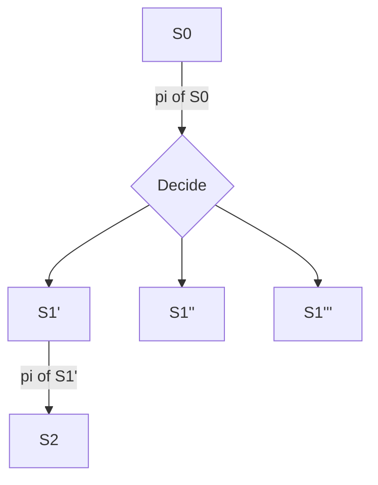

# Fully Observable Nondeterministic planning (FOND) Planning
New way that superseedes classical planning, where $S \rightarrow_a S'$. In this case we know the sequence of states.
In FOND planning, for a given state and an action we have many possible outcome states. Observation of the action outcome is necessary. Formalizing, we have $\delta:S \times A \rightarrow 2^S$
Planning becomes more challenging, since the outcome of the $\delta$ function is nondeterministic.
### Policy function
We need to have another function $\pi:S\rightarrow A$ which tells us for every state what action to do, which we'll call _pollicy function_, that we will use for contingency plans.

A plan will always be defined as 
$$
P=<D = <S,A,\alpha,\delta>,s_0, G \subset S>
$$
A policy is a __solution__ if all possible states will get you to the goal states.

We'll have a plan if there is a path in the tree which contains a goal tree (these kinds of trees are called **and-or trees**, for which we'll do an **and-or search**. We may also encounter loops, for which we have to backtrack.
We'll do an example[^1].

#
```
Policy AO-search (D, s_0, G){
	return OR-search(D, s_0, G, eps);
}
```
sigma parameter is the path that we have taken up to the node, so that we can detect loops. At first, delta is empty (so is called epsilon).
```
Policy OR-search(D, s, G, sigma){
	if (s in G)
		return pi_0; # Empty policy
	if (s occurs in sigma)
		return fail;
	for every action a in alpha(s){
		pi =  AND-search(D, s, a, G, sigma + s)
		if (pi != fail)
			return pi U {<s,a>};
	}
	return fail;
}
```

```
Policy AND-search(D, s, a, G, sigma){
	pi = pi_0; # Empty policy
	for every (s' in delta(s, a)){
		pi' = OR-search(D, s', G, sigma);
		if (pi' == fail)
			return fail;
		pi = pi U pi'
	}
}
```

[^1]: Hehe I don't know where to find it in book, but point in video is [here](https://www.youtube.com/live/oAOKWBkpzhg?si=OHIxxZ-PjqtOUCpw&t=2009)
